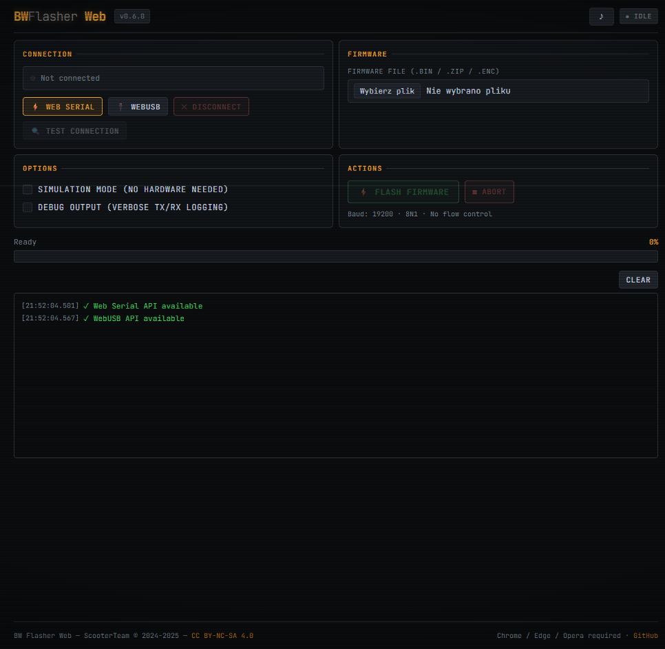

# bw-flasher-web
Flashing Brightway and LEQI scooter controllers using UART.

## 🔓 Our Principles

**You own what you buy.** If you purchased a device, you have the right to understand how it works, repair it, and modify it. Vendors should not lock you out of hardware you own.

**Knowledge should be free.** Reverse engineering findings belong in the public domain. Hoarding this information only empowers those selling black-market tools while honest users stay in the dark.

**Transparency over obscurity.** Weak encryption and absent authentication are security flaws, not secrets to protect. Documenting them pushes manufacturers toward better security.

**Personal responsibility matters.** We provide tools for research and education. What you do with them—and the consequences—are yours. Know your local laws. Prioritize safety.

**No commercial exploitation.** This work is shared freely for the community, not for building products that profit from bypassing safety features.

**This is not an invitation to break laws or endanger people. This is an assertion that understanding technology is a fundamental right.**

## Further Documentation

- [Our Principles](PRINCIPLES.md) - Learn about the core values guiding this project.

- [Legal Disclaimer](LEGAL_DISCLAIMER.md) - Important information regarding legal responsibilities and risks.

- [Contributing Guidelines](CONTRIBUTING.md) - How to contribute to the project.

## ⚠️ IMPORTANT SAFETY WARNING

**Modifying device firmware can be dangerous and illegal.**

- May void your warranty
- May violate local laws and regulations
- Creates serious safety risks by bypassing manufacturer safety features
- Modified devices may be illegal to operate
- You assume ALL liability for injuries, accidents, and legal consequences

**Use at your own risk. This software is for educational and research purposes only.**

## Disclaimer
This software is not affiliated with, endorsed by, or associated with any company. Use of this tool is entirely at your own risk, as it is provided as-is without any guarantees or warranties. The developers of this software assume no responsibility for any damage, malfunctions, warranty voidance, or legal consequences resulting from its use. This tool is intended solely for personal use, and users are fully responsible for ensuring compliance with local laws and regulations regarding modifications. By using this software, you acknowledge and agree to these terms.
